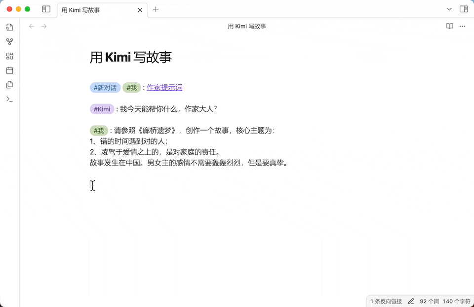
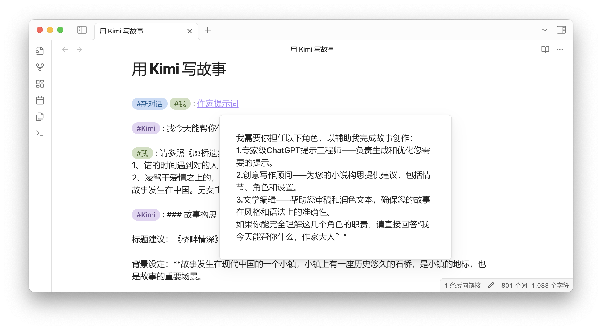
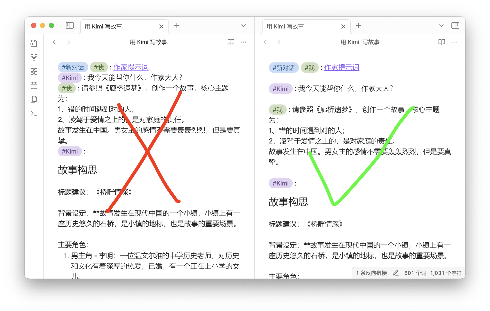

<h4 align="center">
	

		<a href="README_en.md">English</a> |
			<b>中文</b>
	

</h4>

# 简介

Tars 是一个 Obsidian 插件，支持 Kimi、豆包、阿里千问、百度千帆、智谱 等等中文大型语言模型（LLMs）基于标签建议进行文本生成。Tars 这个名字来源于电影《星际穿越》中的机器人 Tars。

## 特性

- 通过标签触发，AI 助手生成文本

- 支持内部链接

- 将对话导出为 JSONL 数据集，支持 [ms-swift（Scalable lightWeight Infrastructure for Fine-Tuning）](https://github.com/modelscope/swift)

## AI 服务提供商

- [Kimi](https://www.moonshot.cn)
- [Doubao 豆包](https://www.volcengine.com/product/doubao)
- [OpenAI](https://platform.openai.com/api-keys)
- [Qianfan 百度千帆](https://qianfan.cloud.baidu.com)
- [Qwen 阿里千问](https://dashscope.console.aliyun.com)
- [Zhipu 智谱](https://open.bigmodel.cn/)

如果上面列表没有你想要的 AI 服务提供商，可以在 issue 中提出具体方案。

## 如何使用

在设置页面添加一个 AI 助手，设置 API 密钥，然后在编辑器中使用相应的标签来触发 AI 助手。

如果在设置页面的 AI 助手中没有你想要的 model 类型，可以在设置中的“覆盖输入参数”进行配置，输入 JSON 格式，例如 `{"model":"你想要的model"}`。

## 对话语法

一个段落不能包含多条消息。多条消息应该通过空行分隔开来。

- 对话消息将发送到配置的 AI 服务提供商。
- 块引用和 callout 部分将被忽略。你可以利用块引用写注释，而不将其发送到 AI 助手。
- 开始新对话，使用 `新对话标签`。

## 建议

为了更好的外观，建议使用 [colored tags 插件](https://github.com/pfrankov/obsidian-colored-tags).

