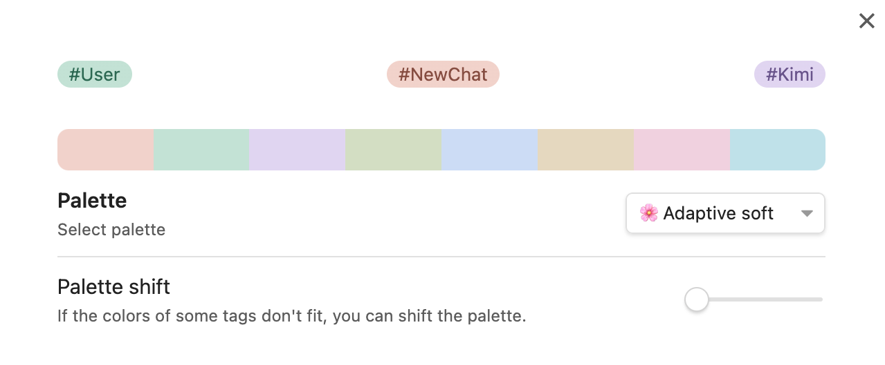

<h4 align="center">
    <p>
        <b>English</b> |
        <a href="https://github.com/TarsLab/obsidian-tars/blob/main/README.md">中文</a>
    </p>
</h4>

# Introduction

Tars is an Obsidian plugin that supports text generation based on tag suggestions, using services like Claude, OpenAI, Kimi, Doubao, Qwen, Zhipu, DeepSeek, QianFan & more. The name Tars comes from the robot Tars in the movie "Interstellar".

## Features

- Text generation AI assistant triggered by tags


- Support for internal links


- Export conversations to JSONL dataset, supports [ms-swift (Scalable lightWeight Infrastructure for Fine-Tuning)](https://github.com/modelscope/swift)

## AI providers

- [Claude](https://claude.ai)
- [OpenAI](https://platform.openai.com/api-keys)
- [Kimi](https://www.moonshot.cn)
- [Doubao](https://www.volcengine.com/product/doubao)
- [Qianfan](https://qianfan.cloud.baidu.com)
- [Qwen](https://dashscope.console.aliyun.com)
- [Zhipu](https://open.bigmodel.cn/)
- [DeepSeek](https://www.deepseek.com)
- [Azure OpenAI](https://azure.microsoft.com)

If the AI provider you want is not in the list above, you can propose a specific plan in the issue.

## How to use

Add an AI assistant in the settings page, set the API key, and then use the corresponding tag in the editor to trigger the AI assistant. Trigger through a conversation form, with user messages first, then trigger the AI assistant to answer questions.

```text
#User : 1+1=?（user message）
(blank line)
#Claude :（trigger）
```

If you are not satisfied with the AI assistant's answer and want to retry. Use the plugin command "Select the message at the cursor", select and delete the AI assistant's response content, modify your question, and trigger the AI assistant again.

If the model type you want is not in the AI assistant in the settings page, or the server address needs to be customized, you can configure it in the "Override input parameters" in the settings, input JSON format, for example `{"model":"your model", "baseURL": "your url"}`.

## Conversations syntax

A paragraph cannot contain multiple messages. Messages should be separated by blank lines.


- The conversation messages will send to the configured AI assistant.
- Blockquote and callout sections are ignored. You can make annotations without sending them to the AI assistant.
- Start a new conversation with `new conversation tag`.

## Recommended

For better appearance, it is recommended to use the [colored tags plugin](https://github.com/pfrankov/obsidian-colored-tags).


